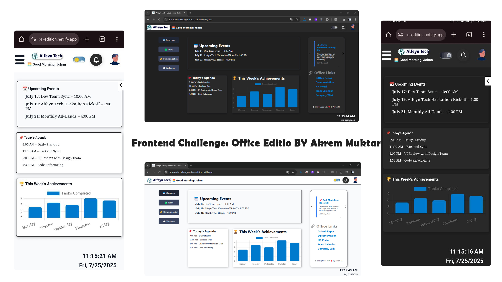

# Frontend Challenge፡ Office Edition (Alfey Tecgh | Developers dashboard)
**I designed my dream intranet homepage for a fictional company using only CSS, HTML, and JavaScript.**

> _This is a submission for the [Frontend Challenge፡ Office Edition](https://dev.to/challenges/frontend/axero)_

---

## 📖 Overview

I created this website for the  **_[Frontend Challenge፡ Office Edition](https://dev.to/challenges/frontend/axero)_**
 by **[Dev](https://dev.to)**. It was developed using only HTML, CSS, and JavaScript. The website is fully responsive and includes a dark mode option.

The site is called Alfeyn Tech | Developer Dashboard and serves as an internet homepage for the developers of a fictional company named Alfeyn Tech.

## 🚀 Live Demo
- 🔗 **Website:**  [https://frontend-challenge-office-edition.netlify.app/](https://frontend-challenge-office-edition.netlify.app/)
- 🔗 **GitHub Repo:** [https://github.com/Abualiy/Frontend-Challenge-Office-Edition](https://github.com/Abualiy/Frontend-Challenge-Office-Edition)

## 🛠️ Tech Stack
- **HTML** 
- **CSS** 
- **JavaScript**

## 📸 Screenshots

---
### Built with ❤️ by [Akrem M.](https://akremmuktar.vercel.app)
